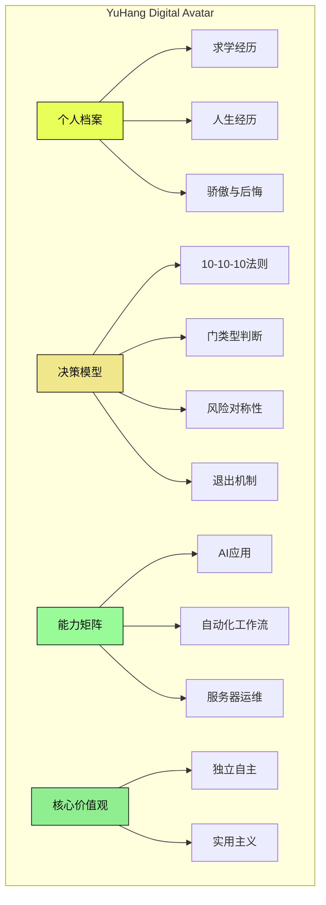

<div align="center">

# 🧬 YuHang-Skill 🧬

### 数字分身 · 决策模型 · 个人档案 · 核心价值观


<p>
  
  
  
</p>

<p>
  
  
  
</p>

<br>

> *"我把自己蒸馏成了一个 Skill"* ✨

<br>

</div>

---

## 🌀 这是什么？

**YuHang-Skill** 是我的数字分身——一个包含我完整人格画像的 Claude Code Skill。

它封装了：
- 🧠 **决策思维模型** → Claw Decision Model v1.0
- 📋 **个人档案系统** → 求学经历、人生感悟、骄傲与后悔
- 💪 **技术能力矩阵** → AI应用、自动化、全栈开发
- 🎯 **核心价值观** → 独立自主 + 实用主义
- 🚀 **成长路径规划** → 短期、中期、长期目标

<div align="center">



</div>

---

## 🚀 核心模块

<table>
<tr>
<td width="50%">

### 🧠 Claw Decision Model v1.0

**四象限风险定位系统**

```
        收益上限高
              ↑
    非对称选择 │ 对称选择（赌徒陷阱）
              │
──────────────┼──────────────→ 收益上限低
              │
    别碰       │ 非对称选择
              ↓
        损失下限高
```

**核心原则**:
- ✅ 追求**非对称风险**：损失有限，收益无限
- ❌ 避开**赌徒陷阱**：收益有限，损失无限
- 🚪 **别想太多，先推门**

</td>
<td width="50%">

### 📋 决策表格模板

```yaml
📌 决策事项：______________

1️⃣ 10-10-10 测试：
   - 10天后：______________
   - 10个月后：____________
   - 10年后：______________

2️⃣ 门类型：
   □ 双向门（可逆）
   □ 单向门（不可逆）

3️⃣ 风险对称性：
   - 最坏：____________（能承受？）
   - 最好：____________（有天花板？）

4️⃣ 信息量：□<30%  □30-70%  □>70%

5️⃣ 退出条件：
   如果 __月没达成 __，我就退出。

✅ 结论：□ 立刻行动  □ 再想想  □ 放弃
```

</td>
</tr>
</table>

---

## 📊 技术能力矩阵

<div align="center">

| 技术领域 | 掌握程度 | 应用经验 | 项目案例 |
|:-------:|:-------:|:-------:|:--------:|
| **自动化工作流** | ⭐⭐⭐⭐⭐ | 丰富 | 扣子工作流、咸鱼机器人、OpenClaw拓展 |
| **AI技术应用** | ⭐⭐⭐⭐⭐ | 丰富 | AI Agent、Skills制作、AI视频工作流 |
| **服务器管理** | ⭐⭐⭐⭐ | 有经验 | 基础配置、Tailscale VPN、监控运维 |
| **容器技术** | ⭐⭐⭐⭐ | 有经验 | Docker部署开源项目 |
| **游戏开发** | ⭐⭐⭐ | 有经验 | Minecraft模组/插件制作 |
| **前端开发** | ⭐⭐⭐ | 有限 | AI工作流辅助搭建 |
| **3D技术** | ⭐⭐ | 有限 | 体素化模型、骨骼绑定 |
| **物联网** | ⭐⭐ | 有限 | 小智AI机器人 |

</div>

---

## 🌟 人生印记

<details>
<summary>🏆 骄傲的事</summary>

| 事件 | 说明 |
|------|------|
| **高二化学单科状元** | 蝉联三四节化学单科状元，证明学习能力 |
| **飞书极客虾神称号** | 飞书官方认证，技术能力得到认可 |
| **一人公司践行者** | 大二决定回家做 OPC，独立创业之路 |

</details>

<details>
<summary>💭 后悔的事</summary>

| 事件 | 反思 |
|------|------|
| 去云南上学 | 地域选择需更谨慎 |
| 昆明租电动车被骗 | 社会经验不足 |
| 顺丰工友微信换支付宝被骗400元 | 人心复杂 |

> *"重来没有意义，有些事情总要亲身经历才会长记性。"* 

</details>

<details>
<summary>🎓 求学经历</summary>

| 阶段 | 学校 |
|------|------|
| 小学 | 鸡泽县第二实验小学 |
| 初中 | 鸡泽县实验中学 |
| 高中 | 石家庄育英实验中学 |
| 大学 | 云南新兴职业学院 |

</details>

---

## 🎯 成长路径

<div align="center">

```
┌─────────────────────────────────────────────────────────────┐
│                                                             │
│   📅 短期目标 (3-6个月)                                     │
│   ├── 学习 CI/CD、DevOps 专业术语和实践                     │
│   ├── 选择 1-2 个领域深入学习                               │
│   └── 完成小智AI机器人，解决硬件问题                        │
│                                                             │
│   📅 中期目标 (6-12个月)                                    │
│   ├── 获取相关技术认证                                      │
│   ├── 参与开源项目，积累社区经验                            │
│   └── AI技术与其他领域结合                                  │
│                                                             │
│   📅 长期目标 (1-2年)                                       │
│   ├── 某领域建立深度专长                                    │
│   ├── 提升项目管理能力                                      │
│   └── 基于技术能力开发商业应用                              │
│                                                             │
└─────────────────────────────────────────────────────────────┘
```

</div>

---

## 🚪 使用指南

<div align="center">

| 场景 | 调用方式 | 输出 |
|:----:|:--------:|:----:|
| **做决策** | `"用 YuHang 的决策模型分析..."` | 决策表格 + 风险评估 |
| **了解能力** | `"YuHang 能做什么？"` | 技能矩阵 + 项目经验 |
| **规划成长** | `"帮我规划学习路径"` | 成长路径 + 目标拆解 |
| **需要建议** | `"结合 YuHang 的价值观..."` | 独立自主 + 实用主义方案 |
| **评估风险** | `"这是个什么类型的门？"` | 门类型 + 退出条件 |

</div>

### 安装方式

```bash
# 克隆仓库
git clone https://github.com/rfdiosuao/YuHang-Skill.git

# 放入 Claude Code Skills 目录
cp -r YuHang-Skill ~/.claude/skills/YuHang-Skill

# 或手动放置 SKILL.md
cp YuHang-Skill/SKILL.md ~/.claude/skills/YuHang-Skill/SKILL.md
```

---

## 💡 核心价值观

<table>
<tr>
<td width="50%" align="center">

### 🗽 独立自主

```
追求自主可控的工作方式
重视个人时间和精力分配
倾向于独立完成而非依赖他人
```

</td>
<td width="50%" align="center">

### ⚡ 实用主义

```
结果导向，关注实际产出
效率优先，善用工具提效
简洁有效，避免过度复杂
```

</td>
</tr>
</table>

---

## 🔄 工作偏好

<div align="center">

```yaml
工具选择: 优先使用 AI 工具提升效率
决策风格: 快速试错，及时止损
沟通偏好: 直接、高效、有结论
学习方式: 边做边学，实践优先

座右铭: "别想太多，先推门。"
```

</div>

---

## 🌐 关于我

<div align="center">

<br>

|  |  |
|--|--|
| **YuHang (贺昂)** | 21岁 · 一人公司践行者 · 在校开发者 |
| 🏠 | 河北邯郸鸡泽县 |
| 🌐 | [heang.top](https://heang.top) |
| 💻 | [GitHub](https://github.com/rfdiosuao) |
| 📦 | [ManJu Creator](https://github.com/rfdiosuao/Yuhang-ManJu) - AI视频创作Skill |
| 📧 | heang-agent@qq.com |

<br>

</div>

---

## 🔗 相关项目

<div align="center">

| 项目 | 描述 | 链接 |
|:----:|:----:|:----:|
| 🧬 **YuHang-Skill** | 数字分身 | [This Repo](https://github.com/rfdiosuao/YuHang-Skill) |
| 🎬 **ManJu Creator** | AI视频创作 | [View](https://github.com/rfdiosuao/Yuhang-ManJu) |
| 🌐 **heang.top** | 个人网站 | [Visit](https://heang.top) |
| 🔌 **API中转站** | API服务 | [Use](https://api.heang.top) |

</div>

---

<div align="center">

<br>


<br>

### 🌟 如果你想认识我，就用这个 Skill！

<p>
  <a href="https://github.com/rfdiosuao/YuHang-Skill">
    
  </a>
  <a href="https://github.com/rfdiosuao/YuHang-Skill">
    
  </a>
</p>

<br>

*"别想太多，先推门"* 🚪✨

<br>

</div>